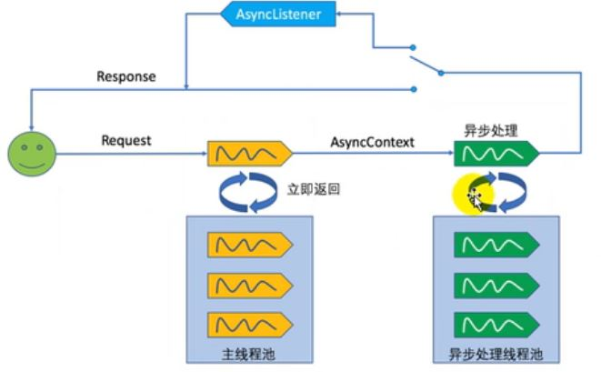

注：所有示例为不使用配置文件的方式

# Shared libraries (共享库)/ runtimes pluggability（运行时插件）

1.  Servlet容器启动会扫描，当前应用里面每个jar包的
    ServletContainerInitializer的实现类
2.  提供ServletContainerInitializer的实现类
        必须绑定在 META-INF/services/javax.servlet.ServletContainerInitializer
        文件的内容是  ServletContainerInitializer实现类的全类名

总结： 容器在启动应用的时候，会扫描当前应用每一个jar包里面
      META-INF/services/javax.servlet.ServletContainerInitializer
      指定的实现类，启动并运行这个实现类的方法;传入感兴趣的相关类型
      
      
    ServletContainerInitializer
    
    @HandlesTypes        
        
***       
##   注册组件：

 	自己实现可以使用注解@WebServlet、@WebFilter、@WebListener等				@WebInitParam
 	当引入三方包时,可用ServletContext注册

	使用ServletContext注册Web组件（Servlet、Filter、Listener）
	使用编码的方式，在项目启动的时候给ServletContext里面添加组件
		必须在项目启动时添加；
		1、{@link ServletContainerInitializer#onStartup(Set, ServletContext)} 获取ServletContext
		2、{@link ServletContextListener#contextInitialized(ServletContextEvent)} ServletContextEvent获取ServletContext        
        
        
        
        
>    idea tomcat控制台中文乱码: -Dfile.encoding=UTF-8

#   异步处理

